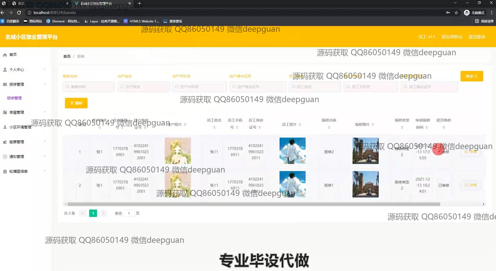

<h1 align="center">基于Spring boot的名城小区物业管理系统</h1>

## 简介
名城小区物业管理系统：角色分为管理员和用户；提供登录注册、房屋管理、缴费管理、报修管理、信息查询、通知公告、论坛互动等功能，实现高效便捷的小区物业管理。    --计算机毕业设计源码；毕设源码；java毕业设计源码

## 联系方式

<h3 align="center">获取完整代码与数据库文件 + 微信：deepguan QQ: 86050149 QQ群: 783742310</h3>

<h3 align="center">可帮忙远程部署 包运行成功！提供远程部署、修改代码、设计文档指导、代码讲解等服务！</h3>

## 功能介绍（完整见运行截图）
管理员： 提供用户和员工的账号注册和登录，访问个人中心进行信息和权限管理，查看和编辑房屋管理信息，支持物业费和日常维修管理，通过后台管理端处理小区环境和设备的维护信息。可以发布和管理通知公告，管理住户和员工信息，查看物业的各类报表与数据统计，支持论坛和讨论区的管理，接受和审核报修请求。

物业管理员： 管理社区的房屋信息和用户数据，处理住户的维修申请和日常物业费用管理。提供详细的住户资料查看功能，包括联系方式及报修状态，通过查询功能快速检索住户或房屋信息。此外，负责维护和发布新的物业公告，协助管理员处理小区环境管理事务。

住户： 注册登录后访问个人中心查看和编辑个人信息，上传头像和改动住户资料，并查看账户余额。报修管理功能允许住户提交新的维修请求并查看历史记录，支持物业费缴纳和查看历史账单，可以在论坛中查看帖子和参与讨论。

员工： 登录系统后根据职能访问相应的管理模块，包括处理住户的维修请求、协助物业管理员完成报修管理和物业的数据录入。参与社区通知的管理和维护，查看自己的信息和工单状态，确保员工之间的信息和任务的共享。

## 运行截图

本代码来源于网络,仅供学习参考使用!

